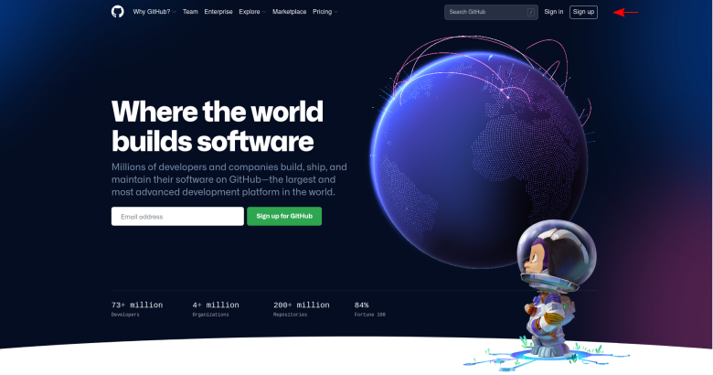
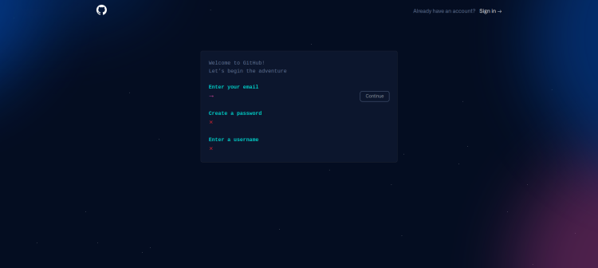
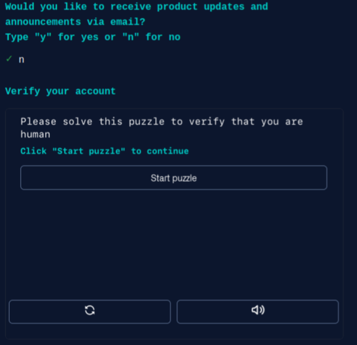
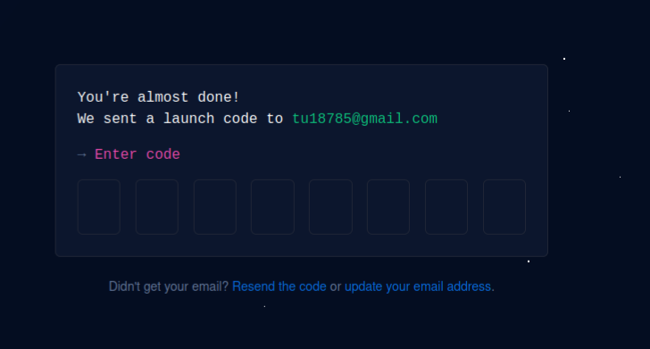
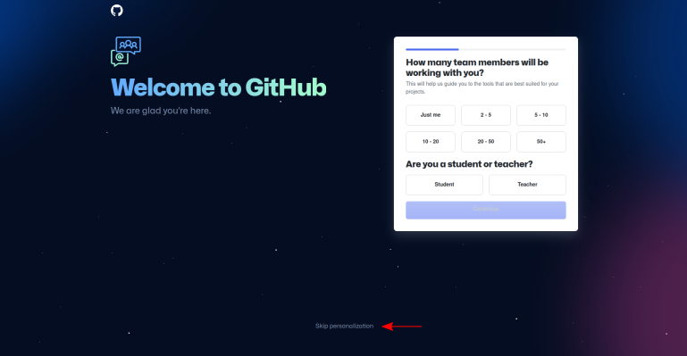
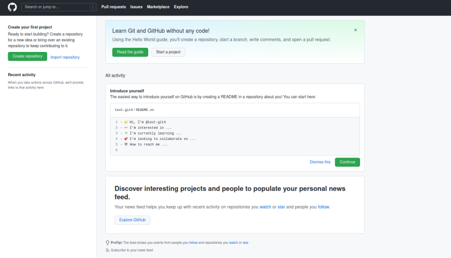

   

 

<h1> 
  

     Criar uma conta no GitHub
  

</h1>

 
 

Acesse o endereço <https://github.com/> e no canto superior direito
clique em **Sign up** e siga o passo a passo. 

 

Preencha seu e-mail e crie uma senha e nome de usuário.

 

Em seguida responda se aceita receber atualizações de produtos e
anúncios e resolva o captcha.

 

Preencha a senha recebida no e-mail.

 

Em seguida, o usuário pode personalizar a conta ou pular essa etapa
clicando em **Skip personalization**.

 

Assim, será criada a sua conta no GitHub. O usuário pode agora
[personalizar](https://docs.github.com/pt/account-and-profile/setting-up-and-managing-your-github-profile/customizing-your-profile/personalizing-your-profile)
o perfil, o
[readme](https://docs.github.com/pt/account-and-profile/setting-up-and-managing-your-github-profile/customizing-your-profile/managing-your-profile-readme)
e criar os
[repositórios](https://docs.github.com/pt/get-started/quickstart/create-a-repo).

[Aqui](https://github.com/matiassingers/awesome-readme) há exemplos de
perfis personalizados para a sua inspiração.

