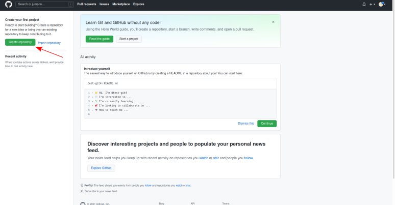
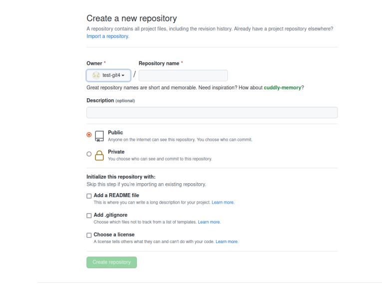
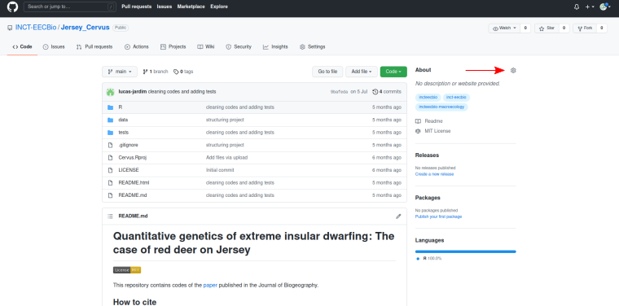
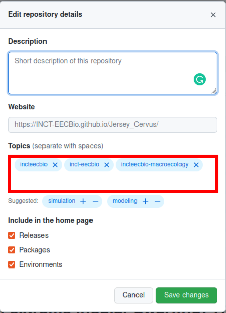

   

 

<h1> 
  

     Criar um repositório 
  

</h1>

 
 

Após criar a conta no GitHub, no canto esquerdo da página clique em **Create repository**, para iniciar a criação de um repositório.

 

Nessa página crie um **nome** para o repositório, escolha se ele será **público** ou **privado**, faça uma **descrição** do projeto, adicione um arquivo **README**, um arquivo **.gitignore** e escolha uma **licença**. 

 

## README

Em todo repositório deve haver um arquivo **README** descrevendo o repositório. O arquivo **README** é escrito em [Markdown](https://pt.wikipedia.org/wiki/Markdown) e deve conter um **título** do projeto ou do artigo relacionado ao projeto, a **licença** do projeto, como o projeto deve ser **citado**, uma **descrição das pastas e dos arquivos**. Pode haver também outros itens opcionais como uma descrição dos dados, para facilitar a compreensão do usuário sobre o projeto, e a apresentação do financiamento. [Aqui](https://github.com/INCT-EECBio/Jersey_Cervus) há um exemplo de **README**.     

## .gitignore

O arquivo **.gitignore** permite a nomeação de arquivo que não devam ser tornados públicos, ou que não devam ser colocados no repositório. Esse arquivo pode ser adicionado no momento da criação do repositório ou após a sua criação. Para incluir um arquivo **.gitignore** após a criação do repositório, crie um documento de texto (**.txt**) nomeado **.gitignore** e adicione no texto os nomes ou caminhos dos arquivos que devem ser omitidos do repositório. Informações mais detalhadas podem ser encontradas [aqui](https://docs.github.com/pt/get-started/getting-started-with-git/ignoring-files).   

## Licença

Os repositórios do INCT-EECBio tem como objetivo tornar os projetos desenvolvidos mais acessíveis para um público amplo. Portanto sugerimos que os repositórios tenham licenças [Open Source](https://pt.wikipedia.org/wiki/C%C3%B3digo_aberto). [Aqui](https://choosealicense.com/) há várias opções de licenças que podem ser escolhidas para o seu repositório, incluindo as [Open Source](https://choosealicense.com/licenses/). Na maioria das vezes a licença [MIT](https://pt.wikipedia.org/wiki/Licen%C3%A7a_MIT) será adequada, permitindo uso comercial, distribuição, modificação e uso privado, sendo condicionado o uso da mesma licença e a citação do projeto original.

## Tópicos

Para permitir a busca pelos repositórios do INCT-EECBio é necessário que todos os repositórios adicionem tópicos relacionados ao INCT-EECBio e ao grupo de trabalho do projeto. Para criar o tópico, no canto direito da página, em **About**, clique em configurações.  

 

Nessa seção adicione os tópicos relacionados ao INCT (*incteecbio*, *inct-eecbio*) e *incteecbio-grupo_de_trabalho* para especificar o grupo de trabalho do repositório. Outros tópicos podem ser incluídos, mas esses são obrigatórios. Cada grupo de trabalho deve incluir os seus respectivos tópicos:

* **Macroecologia e Macroevolução** - *incteecbio-macroecology*

* **Avanços Teóricos e Metodológicos em Ecologia de Comunidades** - *incteecbio-community-ecology*

* **Modelos de Nicho Ecológico e Mudanças Climáticas** - *incteecbio-niche-modeling*

* **Genética e Genômica Evolutiva** - *incteecbio-genetics*

* **Diversidade Funcional e Ecossistemas** - *incteecbio-ecosystem*

* **Conservação da Biodiversidade e Serviços Ecossistêmicos** - *incteecbio-conservation*

* **Monitoramento Acústico Automatizado em Larga Escala de Anfíbios Anuros** - *incteecbio-acoustic*

* **Ecologia Aquática** - *incteecbio-freshwater*

 

   

## Testes

Recomendamos que os repositórios tenham testes dos códigos. Para a linguagem R, os testes podem ser realizados usando o pacote [testthat](https://testthat.r-lib.org/).

