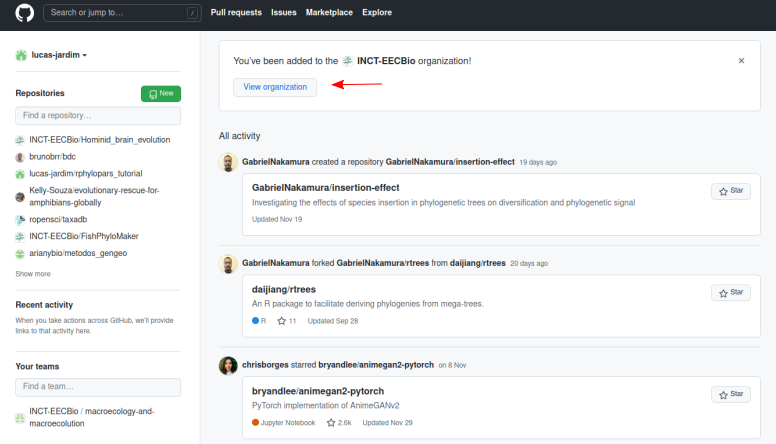
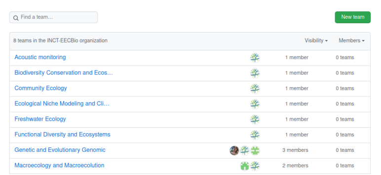
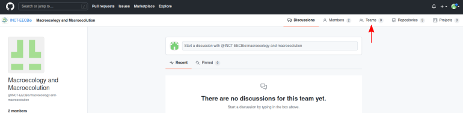

   

 

<h1> 
  

     Criar equipes
  

</h1>

 
 

Na organização INCT-EECBio há 8 equipes, cada uma para um grupo de trabalho. Cada membro 
da organização pode criar outras equipes para configurar as permissões dos colaboradores e membros de um projeto. Cada membro que desejar criar um equipe deve escolher o grupo de trabalho que está inserido e criar um equipe dentro desse grupo de trabalho. Por exemplo, um pesquisador pode criar uma equipe representando o seu laboratório ou um projeto específico ligado à um *workshop* e permitir que somente pessoas ligadas ao projeto ou ao laboratório possam trabalhar nos repositórios daquela equipe. Há também a possibilidade de criar equipes para laboratórios e em cada laboratório equipes para cada projeto. Dessa forma a estrutura do INCT-EECBio pode ser hierarquizada e melhor gerida como equipes. 

Para criar uma equipe clique em **View organization** no painel principal da conta do GitHub ou no endereço https://github.com/INCT-EECBio.

 

Em seguida clique em **Teams**.

 

Escolha o grupo de trabalho.

 

Clique em **Teams**.

 

Por fim, clique em **New Team**.

Após a criação da equipe, os membros podem ser adicionados e sua permissões definidas. [Aqui](https://docs.github.com/pt/organizations/organizing-members-into-teams) há mais informações sobre equipes. 

